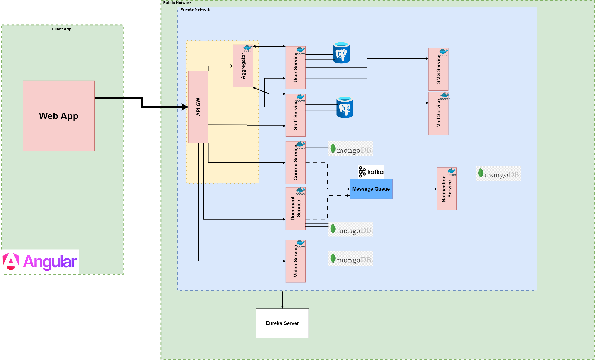

# Video Streaming Platform
Video Streaming Platform developed with a microservice approach using the Spring Framework and Angular.  
This project is still on working.  
## Architecture:

## Used Technologies:
* Back-end: Java 17, Spring (Boot, Cloud, Data, Security), JPA / Hibernate, PostgreSQL,MongoDB,JUnit,Mockito,KafKa
* Front-end: TypeScript,Angular,PrimeNG
* Security: JWT
* FFmpeg
* Docker
* Minikube,Kubernetes(k8s)
* Jenkins
## Work in progress
* Front-end refactoring.
* Back-end refactoring.
* Mail/SMS services.
* Websocket notifications.
* unit and integration testing
## IMPORTANT !!!!!!
* in this project i am using only one database because of the lack of resources.
* the video upload should be in another microservice just to keep the work simple i used only one microservice .
## Features
* video transcoding
* Adaptive Streaming
## Screenshots

  
  
