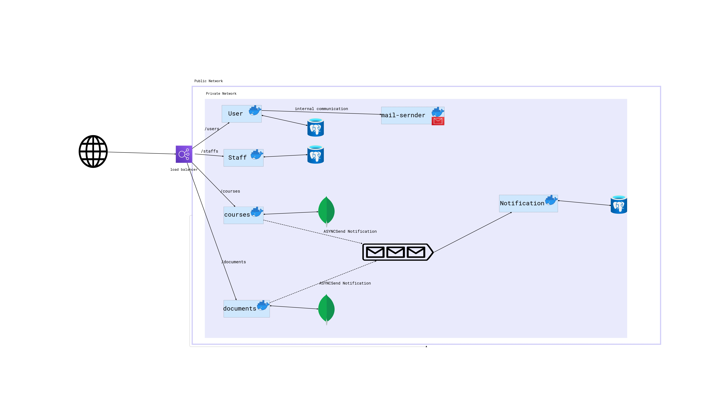

College App
College App developed using the microservice approach using the Spring Framework.
This project is not completed yet there is upcoming features .
Application Architecture

Used Technologies
Back-end:java 17,spring cloud,spring boot,spring data,lombok,jpa,hibernate,postgres,mongoDB,KAFKA
Front-end:upcoming (angular,typescript)
Security:KEYCLOACK
docker
kubernetes(upcoming)
> [!WARNING]  
> work still in progress 
